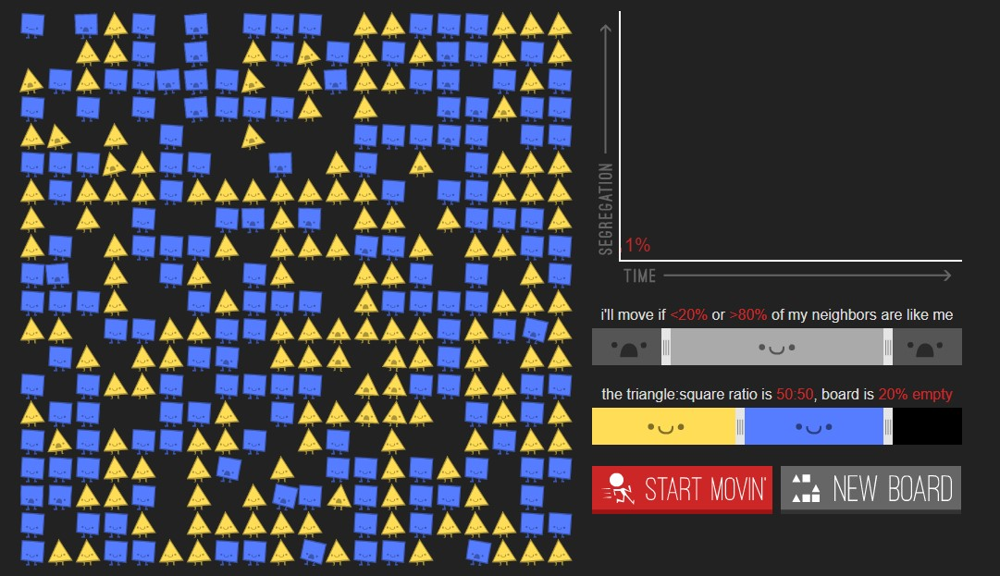

## Prelude

Before we get to the meat of the third interlude, I'd like to contextualize my experience with module 3. On November 23rd, I started feeling symptoms of covid so I had to refrain from showing up as to not infect my collegues. I tested positive the next day. As a result of this, I missed quite a significant chunk of module 3, and although I wanted to catch up at home, covid fatigue often took over and I wasn't able to do as much work as I wanted to.

## what I was trying to do

This module was all about getting familiar with the procedural nature of AI and its implication with digital history and how we make history. It's interesting to think about how there's a part of that "co-collaborator" that we can't control, and that we are just letting it do its thing. I'll explore this aspect more in my [[reflection_interlude3.md]]. 

+ Link to the relevant github repo: [Interlude3](https://github.com/MaxTheBeast300/hist3812-materials/tree/main/Interlude3)

## how it might connect to other research I'm doing

While it may not be discussed much yet, I think procedural thinking and AI assisted concept art might become an interesting force in Architecture as architects attempt to push projects with tight deadlines. Personally, I think I would only use AI as inspiration rather than letting it design me a whole building with plans and all, that takes my human element away and I don't like that. However, the concept art it can create can be really amazing, and paired with my "pattern recognition" that is so ingrained in humans, I can take out some patterns, shape, and ideas that I find intriguing. 

## what I did

+ Raising the Dead with GPT-2  
	+ For this exercise, we tried to raise the dead using GPT-2, an AI, by inputting a book about an historical character and trying to put words in the mouth of that historical figure. We followed Max Wolfe's google [collab notebook](https://minimaxir.com/2019/09/howto-gpt2/).
	+ The first itteration at 355M failed since it ran out of resources, but 124M worked better. The loss for my training remained quite high for a while, only descending by about a few points each itteration - compared to Professor Graham's training which got to 0.00. A bigger loss meant that the model was less accurate, so perhaps the book I chose was not very suitable.
	+ While training the model, an **Ethical Dimension** surfaced: *There was a reluctance to put words in the mouth of the dead.* What does it mean when we put words in the mouth of someone long gone? If sources are not cited, someone could believe that a certain person said something (maybe bad) without knowing it was artificially modelled. How far could this form of impersonation go? We already have deepfakes now and even voice deepfakes, so we could completely fool anyone into saying controversial things. That is scary since it's already happening.
	+ I was very confused while doing my training. I thought I was training the AI with a book of letters by Mozart, but turns out my MozardRTD.txt file was actually pasted with a chopin book I thought of using before... I was wondering why I wasn't seeing any mozart related things and especially why mozart was talking about chopin and the 19th century when HE WAS DEAD IN THE 18th CENTURY!
	+ Once I saw that the file I uploaded was actually raising Chopin rather than mozart, the content started making a little more sense, but since it was a book about chopin (and his letters etc), and that it wasnt actually written by him, I dont know if the accuracy of "his" thoughts are pertinent here.
	+ 
When generating the bulk batch, I think the gpt ai either had some kind of stroke or it REALLY loves the word "critics", here is an extract where it kind of went... well, wild:

``` The critic of the opera critic, who, as I have already stated, is a
pianist, and not a pied Piperi, and does not profess to be a
critic of all the operas, is the only one who can give us an
account of the state of the art in the first two operas. But let us
not lose the little of the critic who says:--

   If you cannot make the first Allegro a very good
   imitation of the first, you must make it a Polonaise.

If the critic of the critic of the critic of the critic of the
opera critic, who is a true artist, can tell us what kind of a
critic he is, we may take from his account--namely, that the first
opera is better than the second:--

   The first is very interesting, but the second is not; but the
   Polonaise is not so interesting.

As the critic of the critic of the critic of the critic of
the critic of the critic of the critic of the critic of the
critic of the critic of the critic of the critic of the critic of the
opera critic, who is a poet, will be remembered, we will not
give ourselves up to the vain hope of finding a better version of our
own favourite work, if we wish to learn from this, and not from
those who have admired it.

Schumann, who was not a critic of the opera, he was not sometimes
a critic of the critic of the critic of the critic of the
opera critic, he was a critic of the critic of the critic of
the critic of the critic of the critic of the critic of the
opera critic, he was not always a critic of the critic of the
opera critic, he was always a critic of the critic of the critic
of the critic of the critic of
```

+ Sonification
	+ The next exercise was sonification. Personally, I love sonification and anything to do with music since music has been a part of my life since as early as 4 years old. It was interesting to see how data was the artistic mind behind sonification. Some may ask what's wrong with that, but I don't think there's anything wrong with that. It can get a little hard tryinig to figure out what the notes could tell us about the data. For example, maybe sometime low notes could indicate a depression in the data category. If the category is birth per day, when the music gets to lower register, its telling us that births those days were lower and might point to some other third party factor like environment, social, or economic factors.
	+ Here's a screenshot of what my process with sonifying my data looked like:


+ Here is the final sonification of the data. It gets more intense as the music goes and shows the progression of the data. It is difficult to make these sonified data harmonious without directly interfering and altering it. You may notice sudden appearances of a high pitch church organ in random locations. Those appear when commuting is most intense, showing when people move the most.


+ Netlogo
	+ Unfortunately, I was not there for this week and missed quite a bit from this week, but I was already familar with the netlogo program from Intro to digital archaeology. 
	+ However, I never really thought about its use in the context of playful history (potential in games, etc). If this program was made into a more intuitive game that players can interact with, what would be the implications of controlling an entire world and what is in it? In the case of the activity, by simulating reproduction of turtles entirely by YOUR principles and decisions, almost feels like the player is playing God and seeing how his world develops. On the other hand, it can be a useful tool to *consider* how the past may have looked about some events like the expansion of Rome and the migration of Indians through the continents at the very beginning of human history. These things can help us visualize things that might not be evident at first. 
+ Parable of the Polygon
	+ The final activity was the  [Parable of the Polygons](https://ncase.me/polygons/). Since I wasn't there for the Netlogo and the Parable, I didn't get the in class explanation of these programs, but I feel like it was a lot easier for me to understand Parable of the Polygons with the visual explanations of its simulation concept. The logical progression of the explanation is a great way of reaching out to a wider audience by removing complicated technical terms and simplifying everything in a visual narrative. 
	+ As I was going through the instruction, it then asked me to move the polygons in this big square until the triangles and square were happy. And so I did.


+ I was now proud of myself for making everyone happy in their corner, but then the author said this line: **"And... our shape society becomes super segregated. Daaaaang."** Oh-. Well, this is awkward. At first, the square felt varied and diverse, but with everyone happy, everyone was now in their own corners, segregated, I didn't see that coming. 
+ We further went on to discuss how a simple crack in their happiness could cascade in a whole event of segregation and isolations in their own corners. 
+ Finally, we explored some square that would automatically sort itself based on some conditions, and see how these conditions changed how the square sorted was really interesting to see. 

+ I found that his activity was really interesting, and showed me that digital history can be really interactive and engaging without having to know all these fancy terms. 

## challenges 

I think the biggest challenge for me this module was a personal one of balancing my health with my work. For the week I had covid, I was sleeping half of the time so that inherently affected my productivity and I had a lot of catching up to do. Because of that, I couldn't go as deep in thoughts while doing ephemeras since I was a little more rushed. It also doesn't help that the AI subject is such a vast unexplored valley of questions that we can only hope to scratch the surface in a measly 3 weeks. 

## thoughts on where to go next

Well, this is the last module, so the next place is the final destination. It's time for me to wrap all my thoughts together and consciously engage with my unessay. Although my unessay will end on the 22nd of december, I feel like I might still continue to engage with it in some way post-class. 