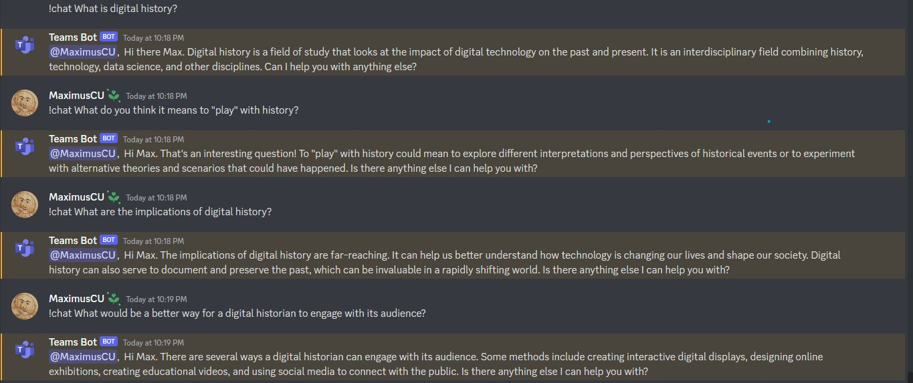

# Introduction 

For this final interlude, I decided to change things a little in favour of increased readability and coherance. For the past two interlude, I have been writing my thoughts down as it came to me and tried to loosely organize it in a more or less comprehensible fashion. This week, I will break my reflection in three parts, each referencing an in-class exercise and the readings. Each parts will reference one week of the module. I will begin by discussing the implications of [prodecural generation](https://hist3812.netlify.app/slides/nov14) in the *context of the GPT-2 exercise* we did and while considering [Aaron Reed](https://if50.substack.com/p/1971-the-oregon-trail?s=r) and [Josh Dzieza](https://www.theverge.com/c/23194235/ai-fiction-writing-amazon-kindle-sudowrite-jasper)'s contribution on the topic of **AI**. I will then follow with a reflection on our process of [sonification](https://hist3812.netlify.app/slides/nov21.html) and its implication in the context of my attempt at sonifying my data. After, I will wrap up with a critical exploration of *self-sustaining simulation and seeing how they can essential play themselves* while reflecting on [Professor Graham](https://www.sidestone.com/openaccess/9789088904363.pdf) and [T. CSzczepanska, A. Angourakis, S. Graham, and M. Borit](https://link.springer.com/chapter/10.1007/978-3-030-92843-8_15)'s exploration of agent based models and social simulations. After exploring all three modules, I will reconsider the themes of this module to the larger themes we have been looking at in previous modules. Finally, I will end with a recontextualization with the Unessay.

## Procedural Generation and the Loss of Control

The first subject of the week was procedural generation and the use of AI in raising the dead. We could sumarize this section as the **emergence** of these computer systems. What does it mean systems to be emergent? I would argue that it is systems that output data based on initial instructions. Once the preliminary instructions are set in place and the machine started, we are left at its mercy as it works away from us, outputting information that we can't quite control. You could say that this form of *randomness* evokes enchantments in digital historians (a concept I extensively talked about in my previous reflection for interlude 2). The excitement to see what kind of results comes out after a long wait of computation and the experimentation with the initial instructions to produce the most interesting and relevant results are ways that produces enchantment. However, at the same time, this enchantment can be categorized as scary and haunting as the unpredictability of the machine overwhelms us. I would argue that I am between in that sense. 

On one hand, the *advent of AI* extremely interests me and pushes what we previously thought was possible in the world of computers like creating entire conversations or generating any forms of art like paintings, music, and literature. On the other hand, I am a scared at the possibility of **losing control over our contribution** in the fields affected by AI. For example, AI art at first appears to be an excellent tool to generate concept art that can inspire and motivate us to create, but it also threatens the livelihood of artists that do a living on art. These AI art generator could start replacing artists as they become more and more refined. And the reason why it works is because of the human element in the art. The AI is trained on **artworks from artists**, as such the human element is trained and the AI just compiles these artworks and generates something. Of course, there is also a problem of copyright and stealing other people's work since AI art is essentially copying a bunch of art and compiling it together. Therefore, we might start to feel a **sense of loss in control** as AI is the one outputting the results whereas we are only instructing it. Aaron Reed in ["2019: A.I. Dungeon' 50 Years of Text Games"](https://if50.substack.com/p/2019-ai-dungeon?s=r) suggests a similar issue of control loss: "The issue of tech like GPT 'disrupting' human creators had also come to seem like more than a fantasy by 2020. 'I am fairly convinced at this point that people will lose their jobs because of advancements in langauge models like GPT-3.'"[^1] This is something quite scary that will need a LOT of regulations and studies. 

I started to feel this when I was raising the dead with GPT-2. Using Max Woolf's [collab notebook](https://minimaxir.com/2019/09/howto-gpt2/), we were able to put words into the mouth of the dead. I have already discussed the implications of making dead people say thing in my [[log_interlude3.md]], so I'll discuss what happens when we are letting the AI do all the work. The first step is to download a book written by an historical figure (preferably dead in our case) and to input the .txt file in collab notebook. Afterwards, after setting up minimal initial instructions, we simply need to let the AI train. After the training, the AI will regurgitate a series of text it generated in the author's style. We can the ask the AI questions, with the intention of asking the **dead historical figure**, and we hope for a response from the "dead person". When we get the result, how should we think about it? Are we reading the words of a dead person, or is it just an illusion created by the AI? Some people might try to find patterns in those results and try to claim certain arguments about a famous dead person, but in doing so, they fall in the  **Eliza-effect**. According to [Techopedia](https://www.techopedia.com/definition/19121/eliza-effect#:~:text=The%20%E2%80%9CELIZA%20effect%E2%80%9D%20is%20a,to%20artificial%20intelligence%20in%20technologies.), the Eliza-effect *"is the idea that people may falsely attach meanings of symbols or words that they ascribe to artificial intelligence in technologies."*[^2] The human mind is trained to try and find pattern in anything it sees. That's why we are so good at puzzles and problem solving. These pattern "instincts" are probably are strongest features and differentiates us from other mammals. However, because we are so reliant on this pattern seeking ability, we try claim any pattern we see as the "truth". 

Therefore, in the case of AI, we try to find patterns that might not even be there. Then, how can we know if the pattern we are seeing is true, and not just a by-product of mathematical amalgamation. Well, I don't really have an answer for that. AI is confusing and I feel like I barely scratched the surface of what *it can really do*. Right now, I don't think I can consider the patterns that stems from AI generation as true because all I am seeing are mathematical computations. The AI is trying to make connection based on pure, logical facts such as words and numbers. What it lacks is the important element of context. What was the context of the data? How does the context of the data impact how we perceive it and how we analyze it? Even more specific, **what is the role of the digital historian here? What is the history happening here?** In all honesty, these are essentially theses and dissertation questions. The implication of the historian in AI is difficult to quantify and qualify right now. On the surface, it seems like we are just the **initiator** of the process, rather than the contributor to the result. We just sit there and wait for the program to spit something out. But, at the same time, it takes a human mind to dissect what is happening in the process. The computer offers us another perspective that hasn't been explored yet, and in doing so, allows us to evolve our critical thinking. 

Finally, for this section, I'd like to end on a more positive notes about AI since I seem to have been rather pessimistic on it so far. In Josh Dzieza's ["The Great Fiction of AI - The strange world of high-speed semi-automated genre fiction."](https://www.theverge.com/c/23194235/ai-fiction-writing-amazon-kindle-sudowrite-jasper), he talks about Jennifer Lepp's experience with AI and text generation in the context of her work. Although she initially felt mix feelings about the impressive results of the AI, she noticed how the process significantly helped increase her productivity and kept her inspiration levels high.[^3] Towards the end of the article, she explains how she's embarrased to "say she's become reliant on it" as she had been using the AI to complete unfinished sentences so that she could focus on the meat of the story.[^4] As a result, she can now work on two series simultaneously which helps her increase her profits, especially among the competitive scene of literature. I thought this story was eye opening for the collaborative potential of AI as a mean of increasing production and helping smaller artists and writers in competing with larger, more well off authors. For now, all we can do, is stay conscious about the implications of letting AI doing work for us and how the value of human interventions will change in the future.

## Sonification and the Transformative Meaning of Data

This section will be a little bit shorter since it was originally not part of the module, but it's implication in digital history is still valuable and should be properly explored as a part of procedural generation. 

We explored two concept: Sonification and Musification. **Sonification**, according to [Professor Graham](https://hist3812.netlify.app/slides/nov21.html), *"is the data-dependent generation of sound, if the transformation is systematic, objective and reproducible."* **Musification**, is defined as *"the representation of data through the musical interpretations of source processes or a course of events in the data 'designed to go beyond direct sonification and include elements of tonality and the use of modal scales to create musical auralizations.'"* Both methods of creating music from data each imply a different result. Sonification is trying to produce raw sounds while musification is trying to stylize the sound we get from data. In both cases, the priority should be to optimize the communication of information rather than just pleasing the ears, and to be honest, sonification will rarely be pleasant to the ear but that's the point! The point is to offer a different outlook on the data , making you flinch backward as you hear a bombardment of dissonant sounds of piano and violin, then suddently the rapid ominous bass ramping up without signs of slowing down. These musical interactions, although strange and rough on the ear, shows the data as the artist expression. This is when musification can come in and collaborate with sonification to further emphasize the efficiency of information communication. 

Sometime, pure sonification can be too overwhelming and too "out there", so musification and alteration of the data in some sense can help bring out some elements to the light. This is something I struggled with while doing my own sonification using the website [twotone](https://twotone-midiout-beta.netlify.app/). The first step I took was to choose a .csv file that would translate well into sounds. Sometimes the categories were not recognized right away which limited the potential of .csv file. For example, this data file had many categories, but only a selected few appeared which made it unusable.

When I did find an appropriate file, I found that sometime there wouldn't be enough variation in the categories to produce different sound. To counter this, I had to increase the octave range of some parts, but then it would create these unnatural low or high pitches that almost grated the ears. After doing the best I could to create a coherent sonification, I came up with this:

Unfortunately, I was at the limit of my skills since I do not know how to properly use music softwares to add musification elements to this raw sonification. So, what was left was just the output of a program. Although I did engage with it in some way, modifying the tempo, changing instruments, and adding tracks, I had little control over specific changes that I wanted to do to better communicate the data. Musification would have added the human element in my computerized sonification. The idea of control relates to the questions I previously asked in the first section. **What is the role of the historian in the process of sonification?** You could say that we are *mediating* the computer and the data and telling it what to use and letting the computer do the rest. But I would argue that by transforming the data through sounds, we are asking the computer to give us another perspective on the data. Ulimately, the impact of this data rest in the hands on the historian to analyze how higher and lower pitch can tell us different things. Right now, the way I see it, is that sonification compliments the interpretation of the original data. By listening to its sonification, we see the data in different colors. We approach it differently. We look at it upside down, from unexplored angles. It enriches our understanding of the data, but in itself, sonified data are difficult to use as conlusive evidence.

## Simulations and Self-Playing Games as Engaging History

The final segment of the final module explored simulations and self-playing games. These are particularly important to the themes in module 3 because they are prime example of emergent systems. I notably enjoyed Professor Graham's ["On Games that Play Themselves"](https://www.sidestone.com/books/the-interactive-past) about the subject of Agent-based model (ABM) and archaeogaming and how the two can intersect. ABM is a model or system that works on agency of its "agents." So, the agents will have rules and limitations that will dictate how they respond to exterior factors. For example, I found this [video](https://www.youtube.com/watch?v=7gtFUeuj0qc) by Charlotte Glennie about simulating grocery shoping using NetLogo. By coding a list of rules for each agents and setting the rules of the setting, she observed how the turtles (her agents) interacted together. The more features/rules there are, the more complex the simulation becomes. However, the player is removed from the action.[^5] All she needs to do is write the instructions and rules of the world, and let it run. Another example of ABM is the [Parable of the Polygons](https://ncase.me/polygons/). The website's main goal is to explains how "harmless choices can make a harmful world" and the author comprehensibly explains it with the use of an ABM. The model is composed of two agents, polygons, a square and a triangle. Each have basic rules: they are happy or they are not. Their happiness can be altered and dictated by including more features like prefering diverse crowds or wanting to move if less than 1/3 of my neighbors are like them. The author created small simulations with evolving features. The more we added rules, the less predictable results became. The agents were interacting between themselves based on an agency we programmed. I talked more about my experience with the parable in my [[log_interlude3.md]]. 

According to Graham, this method (not unique to NetLogo, but in the general world of computers) has been used for decades to simulate past societies.[^6] I find it interesting how Graham worded that players removed themselves from these ABM; so, it was equally interesting to see that by including the player in the model, we could achieve an intersection between ABM and video games. What would happen when we introduce the players inside an ABM instead of letting them become a "god", because that is essentially what you are when you are removed from the simulation. You control everything. You decide who dies, who does what, who moves, what moves. While you cannot control the precise outcome, you can control the rules. As Graham stated, this "power" in the digital landscape can be alluring and seductive to the point that sometimes we might mistaken what we simulated for the truth, or even convince others.[^7] Then, when the player is introduced in the ABM as an actual player, will they still think that the simulation is true? Well, I would argue that if the simulation is believable enough, we could definitely smear the line between what is "real" and "fake", what is alive and what is just a program, but I digress in matrix stuff.  What introducing the player in ABM can do is create this archaeogaming environment that stimulates the player's understanding of their environment and social interactions. Sure, it's fairly easy to think of some Agent-Based model that are present in games that places the player inside a world of conditions. An easy example is that of the world of GTA 5. 

GTA 5 places you in a world full of conditions and agents that can directly interact with you. Some of them are pre-programmed for very specific interactions where you have dialogues and choices, but others are just "living" in the world. For examples, citizens can do a range of activities. They can walk on the sidewalk, drive cars while following road rules, or participate in events like danceclubs or the Casino. Of course, these are all illusionary ways of making them feel real. They are strictly bound by their conditions and rules, but you, the player, can directly interact with them. You can steal from someone's department store, you can murder a random citizen, or you can steal a citizen's car. How the citizen responds to these interacts are albeit very limited and usually scripted. By interacting with the world, the player gains a better understanding of the rules and they can and cannot do without getting in trouble. While the implications of this game (especially the ethical dimension) are definitely not appropriate for digital history, it teaches the player about the world. In "*Quantum Leaper:* A methodology Journey From a Model in NetLogo to a Game in Unity," the framework of GAM (Games and Agent-Based model) is proposed as a tool to use while creating games with ABM.[^8] The framework works similarly to the HPS framework, but is more applicable to the intersectionality. In applying the GAM reflection framework to their case study game *Quantum Leaper*, the authors show the process of combining games and ABM and doing so critically. I wonder what GTA 5 would look like if we applied it to the GAM framework? It would probably have quite a lot to reflect on... 

It would be amazing to be able to drop in a world where all the NPCs are interacting within each other based on historical nodes of rules, restrictions, and limitations and you, the player, can interact with them and see how it affects both your character and the people you interact with. However, in so doing, we would be creating a tons of questions that needs answers. How could we stop players from being "gods" in these worlds? How do we prevent the seductivity of the digital world, deluding people in believing they are interacting with the truth? Who even controls the rules of the world? Why should they be the one controlling? Should we just let a machine control the world instead of a human? How can we create simulations that are both ethical and historically accurate? These are questions that any digital historian could have a field day with. 

## How does module 3 intersect with module 1 and 2?

Finally, I'd like to briefly compile the themes of this week and explore how they intersect with what we have been looking at so far in the semester.

To recapitulate, in module 1 we focused on the theme of storytelling and linear/non-linear narratives. For module 2, we looked at playfulness in history and what it means to play with history. In module 3, we were exploring the intervention of machine and AI, the digital dimension, into the playfulness of history. So how does everything connect? Now that I see the bigger picture, I really like how this class was structured. Storytelling is the foundation of teaching history. The way you tell someone about the past is important and should be critically reflected. When we looked at museums, we saw how the difference in linear and non-linear narratives affected the engagement of the audience. Then, we learned about playfulness in history. So now we learned how we should do the storytelling of the past: by playing with history! We can play through games, creating augmented reality apps, or remixing the way we see history. Now, we know how we should talk about the past and how to engage with it. Module 3 brought the digital dimension to history in clearer manner. In previous module, it was us, the human mind, that was "playing" with the past, now what happens when we let the machine "play" with the past? When using these machines, such as GPT and NetLogo, we have to consider how the storytelling is told, and the implication of its playing. We can do that by using the HPS framework. 

## Feedback and Recontextualization with the Unessay 

I would like to dedicate this final portion of the reflection to the unessay feedback I received last interlude. I have to admit, when I first thought about doing minecraft for my unessay, I did not really consider how the mechanics would affect the unessay. What does it mean if the player can't destroy anything? What if the player CAN destroy? Is that a bad thing? It was originally our intention to put the player in adventure mode, which means that they cannot fly and cannot break anything. They can only explore, and look. The most important element, the player, had been neglected. We were only thinking of the buildings and building them. As I have seen and explored this module, the player can be removed (in ABM) or included (in GAM). I think in the case of the minecraft world, the inclusion of the player would result in a much more engaging experience for the player. "Does the player have an actual goal, in your museum?" I think it will be important for us to contextualize this goal through the HPS framework, because once we find that clear, definitive goal, all other elements should start falling in. 

Although way out of my abilities, it would be interesting to how I could include AI in that minecraft world. Recently, a friend of mine created this discord bot using an API from openAI. The bot used the chatGPT AI which was trained last year, and who's goal is to "simulate" a real conversation. So, you can ask this bot anything (with a prompt) and it will answer based on the info in its database. Here is an example of some prompts I asked of it:

**So cool, right?** The answers are scaringly relevant and feels like a customer service person just answered my questions. How could I use this in the minecraft world? One way would be to create some sort of guide, that follows the players wherever they go. Everytime the player is curious about a section of the museum, they can ask the bot any questions. It can make them feel like they are talking to someone and learning! There are of course some down side to this. First is that the AI trained based on the 2021 database, meaning that anything that was published after 2021 is not known by the AI. Second, the AI can sometime be "confidently incorrect," as stated by my friend. So, it may appear like the AI is telling you something that seems true, but is in fact just putting together words it thinks are right. You could connect this to the seductiveness of digital landscape that Graham talked in ["On Games that Play Themselves"](https://www.sidestone.com/books/the-interactive-past). These are, of course, only hypothetical ideas that probably won't be included in the final unessay since I am unsure how relevant it could be, but it's really interesting to see how AI is getting more and more involved with our lives.

## Relevant Log Files

Here is my log file: [Log_Interlude3](https://github.com/MaxTheBeast300/hist3812-materials/blob/main/Interlude3/log_interlude3.md.md)

Here is my reflection file: [Reflection_Interlude3](https://github.com/MaxTheBeast300/hist3812-materials/blob/main/Interlude3/reflection_interlude3.md.md)

[^1]: Reed, Aaron. 2021. ‘2019: A.I. Dungeon’ _50 Years of Text Games_ [link](https://if50.substack.com/p/2019-ai-dungeon?s=r)
[^2]: Techopedia, 2022, [link](https://www.techopedia.com/definition/19121/eliza-effect#:~:text=The%20%E2%80%9CELIZA%20effect%E2%80%9D%20is%20a,to%20artificial%20intelligence%20in%20technologies.)
[^3]: Dzieza, Josh. 2022. ‘The Great Fiction of AI - The strange world of high-speed semi-automated genre fiction’ _The Verge_ [link](https://www.theverge.com/c/23194235/ai-fiction-writing-amazon-kindle-sudowrite-jasper)
[^4]: Ibid.
[^5]: Graham, S. 2017.‘On Games that Play Themselves: Agent based models, archaeogaming, and the useful deaths of digital Romans’ in Mol et al., eds. The Immersive Past, 125. [link](https://www.sidestone.com/openaccess/9789088904363.pdf).
[^6]: Ibid, 123.
[^7]: Ibid, 125.
[^8]: CSzczepanska, T., Angourakis, A., Graham, S., Borit, M. 2022. Quantum Leaper: A Methodology Journey From a Model in NetLogo to a Game in Unity. In: Czupryna, M., Kamiński, B. (eds) Advances in Social Simulation. Springer Proceedings in Complexity. Springer, Cham. [link](https://doi.org/10.1007/978-3-030-92843-8_15)