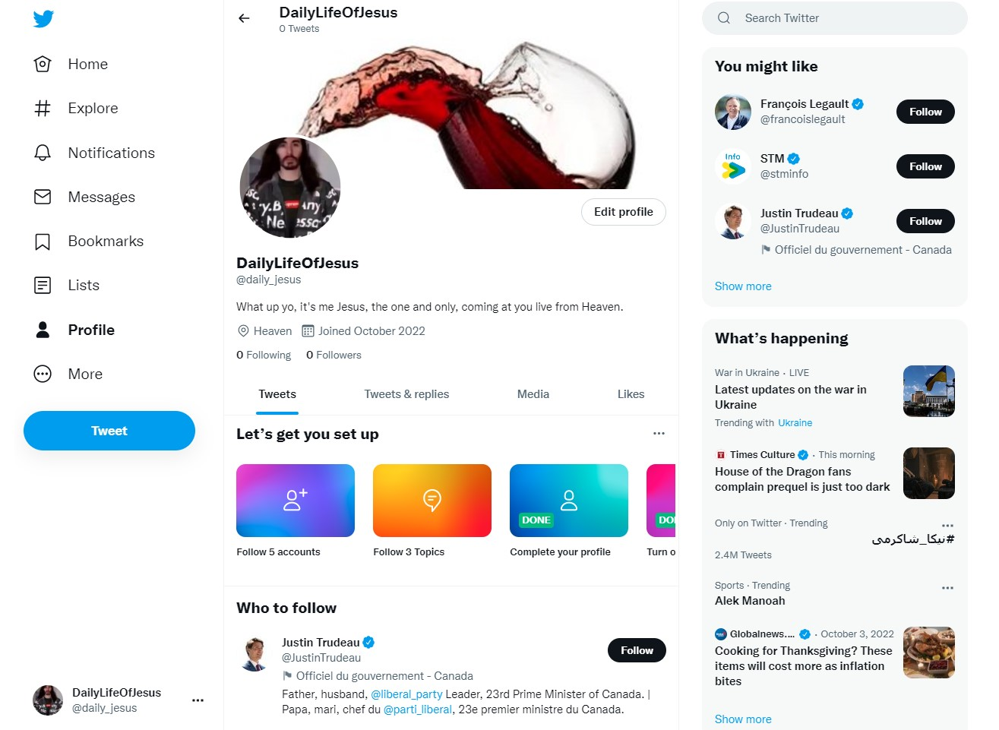
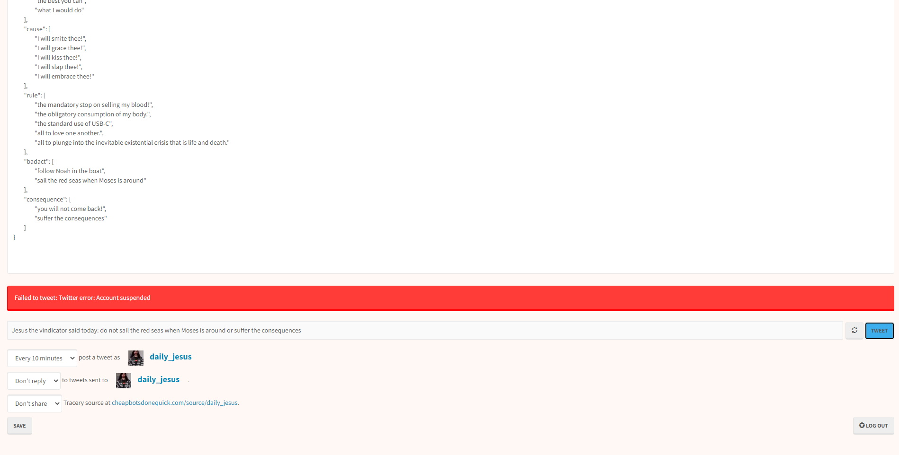
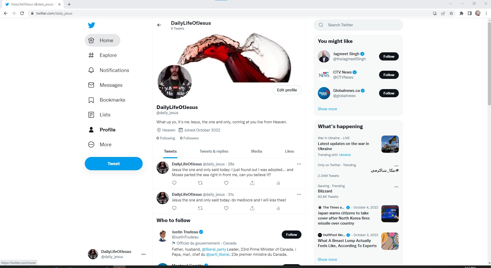
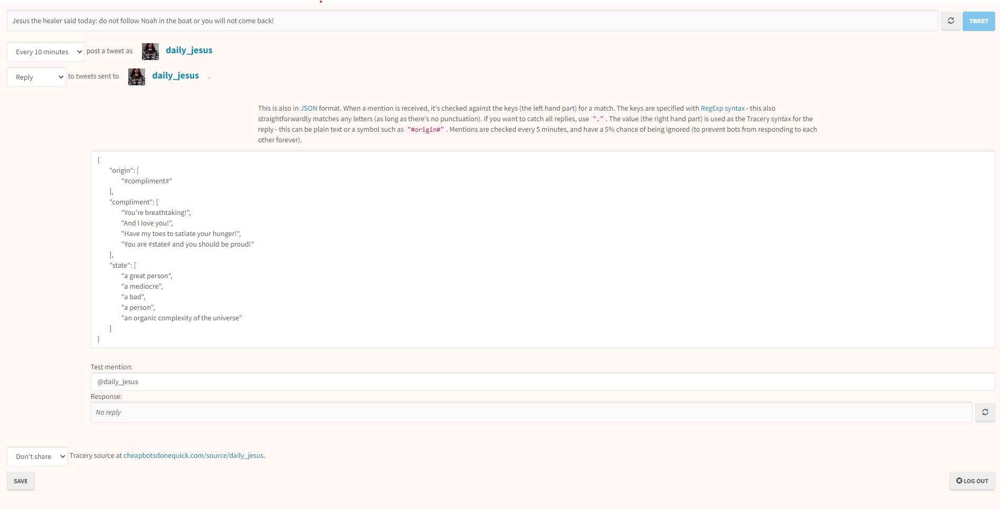

## what I was trying to do

This module was all about storytelling, and the implications that may come with it, may it be on the ethical, social, or technical dimension. For the first five weeks, we tried to do some simple "game" and platform building for storytelling. This include mural, Twine, and twitterbots. 

+ link to the relevant github repo: like this:  [Interstitial 1](https://github.com/MaxTheBeast300/hist3812-materials/blob/main/Interstitial1/log_Interstitial1.md.md)

## how it might connect to other research I'm doing

While my major (architecture) may seem strikingly different than games and storytelling, there is one similar element that stands out to me. In both medium, the main goal is often to "engage" with the viewer, to interact with them, and for them to interact with it. With both circumstances, the way we engage with the past and architecture needs to be carefully curated and thought through. I learned throughout these first few weeks that engagement with something is often grounded in prejudices and social implications. A building may try to interact with its viewer by showing how a certain style may be superior than another, it may try to symbolize power and authority, or it may reinforced systematic social constructions. In short, architecture can tell many a story depending on how it is presented. This is similarly the case with playful engagement with the past. Therefore, I believe that many of "ways of thinking" from this class will be applied to architecture as well.

## what I did

+ Mural 
	+ Mural was a way for us to create a website very easily. This website has a narrative that can be constructed by us, giving us the opportunity for a try at visual storytelling.
	+ I thought it was quite hard to think of an effective way to guide the viewers through the website in a meaningful way and engaging with the past. I think it can be a very powerful storyteller, but at the same time, the fact that the curator can directly control how the viewer engages with the content is a set back. Rather than the viewer engaging with the past, it might feel more like the viewer engaging with the **author's view** of the past. 
+ Atuel
	+ I couldn't show up to class when they played Action Castle (example of storytelling in games) since I was sick, but I had played **Atuel**, a game that was shared by Professor Graham the night before; therefore, I will comment on this instead.
	+ Atuel is a game that places you at the beginning of the river and brings you along its voyage down the mountain and through settlements. It taught me about the river while allowing me to directly interact with the river. For example, while the voice was narrating about the river's origin, I was able to control the infant current squeezing through the mountains. I was also able to play as a fish or a bird, telling me that the river is essential to life and creates it.
+ Twine
	+ Having already done Twine before in previous classes, there wasn't much difficulties that was encountered, but the coming up with an effective idea was still a challenge. I did not engage too much with Twine because I knew that it wasn't quite how I wanted to engage with the past in my unessay. 
+ Twitterbot
	+ This one was a lot of fun! It made me reconsider what we could do with bots in the domain of history. However, it was a little tricky to get working since Twitter can be a bit of a hassle to deal with when trying to create and push forward bots. Here is the account I created.

	
	+ The first error I encountered was twitterbots giving me an error that my twitter account was suspended when it clearly wasn't. It only took a few minutes for me to realize that maybe I only needed to wait a few minutes which seemed to have done the trick (The internet... such a mystery). 

	+ Then, I was able to properly push forward my first tweets and I couldn't stop giggling at myself that this "counterfeit" jesus was saying "un-jesus" things, yet trying to keep the essence of Jesus. 

- I tried to add a reply function, but I didn't have enough time to trouble shoot if it was replying or not. It didn't seem to do much. 
- I don't think I will be using this kind of engagement in my unessay, but it's definitely something I should keep behind my scalp giving how powerful it could be.

## challenges 

The biggest challenge for me these few weeks was coming up with an idea and an **effective** way of engaging with this idea. How do you engage with something meaningfully, while preserving its authencity, and trying to remain unbiased? This is something I will need to get better at if I want to create an unessay that thoughtfully engages with the past while breaking away from these monotomous, scholarly, and academical survey of the past.

## thoughts on where to go next

I want to continue and keep these thoughts in a barrel and ferment them slowly, but not too slowly because I will need to put my unessay into action soon. As for now, I have found a group where a potential minecraft project may happen. It will be a challenge for us to playfully engage with the past using minecraft but also making it meaningful to anyone that may not be familiar with the nature of the game (sandbox). I also have to be careful that I'm not just building something for the sake of building something historical, but actively engaging with the material and narrating a story with its historical context. 

## Unessay

