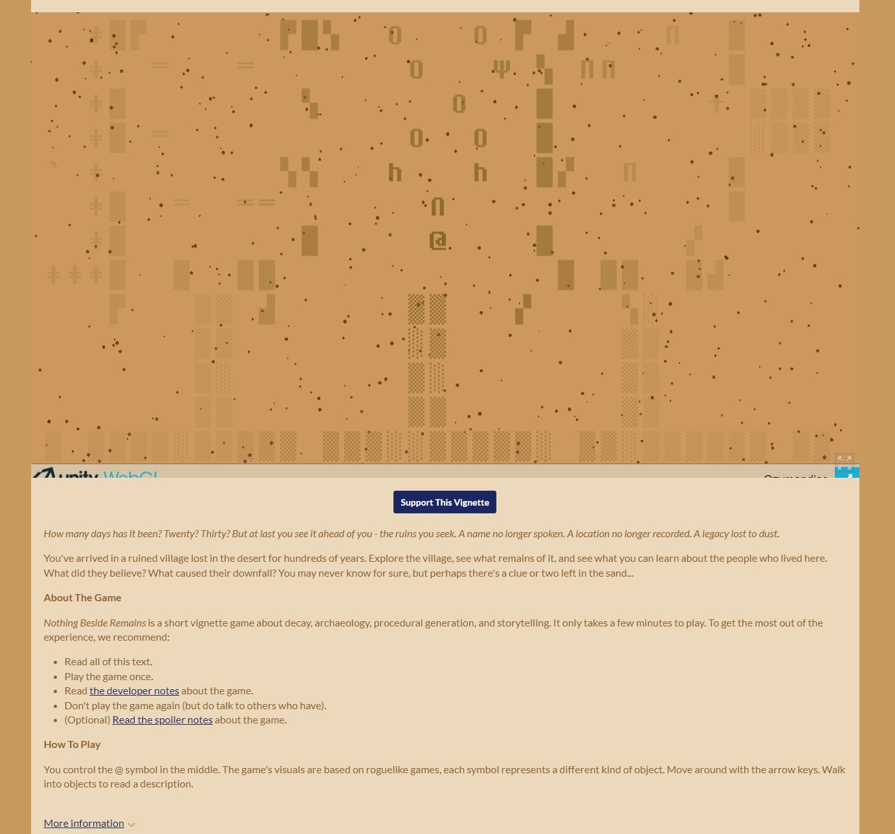
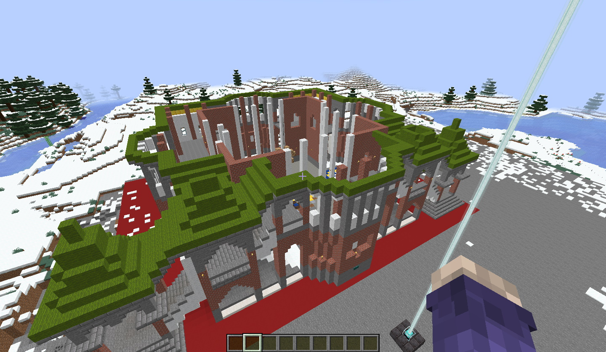

## what I was trying to do

This week was all about getting in that playfulness of play and the implications of playing a game in the historical context. The Historical Problem Space (HPS) Framework was the focus of this module since all the theories that we looked at before applied to the framework and worked hand in hand with framing the grid. 

+ link to the relevant github repo: [interlude2](https://github.com/MaxTheBeast300/hist3812-materials/interlude2)

## how it might connect to other research I'm doing

I feel like the HPS Framework might not be limited to just games since the mentality of its application helps put in focus what the goal of whatever historical piece you are trying to make. For example, on November 2, Professor Graham asked us to try and apply the HPS framework to Mural and we'll see how that went in the steps below... In one word, it was difficult.

## what I did

+ Augmented Reality
	+ The goal of this exercise was to create scanning github page that could scan images and display new information hidden behind the digital world. The relevant repo with my evidence is [here](https://github.com/MaxTheBeast300/3812-ar).
	+ Downloading the images from Professor Graham's repo and repurposing that repo for my own was easy enough, but when I got the github page working and the scan popping up, nothing would come out of the pages I was scanning. I made sure to go through the steps a few times over in case I had done something wrong like a mis-edit in the index file or wrong downloaded data. Nothing worked, so I asked Professor Graham, he gave me a picture I hadn't before and it worked. "Oh," I said. I was scanning the wrong images all along...
	+ Well, after confirming that I was using the **right** images, my little AR exercise started to show results! One of the image showed a photogrammetery model of a tomb stone, one showed a goofy model of some character, while the other did not show anything since nothing was attached.
	+ The professor also talked about using twine and augmented reality and using location as another dimension. I thought that was really interesting in how it forces the player to interact with the physical and digital space all at once. 
	  

+ The next exercise was playing [*Nothing Besides Remains*](https://cutgarnetgames.itch.io/nothing-beside-remains) and trying to apply the HPS model to it. We first looked at it as a group. (*A challenging task!*)
	+ Looking at the genre first, we said that it could be archaeology simulator, walking sim, mystery, or adventure, and even roguelike according to author. Professor said something interesting when we mentioned archaeology simulator, saying that "I don't think there is a archaeology simulator genre," but I'd like to argue: What stops us from creating our own genre? There are so many niche genre nowadays with the rising popularity of indie games, I'm sure if enough people get together, we could get the archaeology genre some subtenance. 
	+ Next, we looked at the gameworld. Some said village ruin in a desert, ozy influence, that it could be greece, persia, rome, or egypt and any ancient place. It is also an explicite space, with clear boundaries that could not be traversed. 
	+ The player was agreed to be the archeologist since context from the author seems to say so.
	+ I don't think I could find any agents, tools, or obstacles, but we could say that the knowledge gain from the artifacts could be a tool in making sense of its historical events. It was also argued that this knowledge could be attributed to resources since its something that accumulates. 
	+ The goal of the game seemed to be to gain understanding of the history of the ruined village. **What happened? Why? How?** These questions are supposed to guide the player in making choices in their playthrough. 

+ After having applied the HPS framework to Nothing Else Remains, the professor intrigued us by asking how we could apply the HPS framework to mural. I will be honest, I had a very hard time with that, and could not really find a concrete application.
	+ Mural is a tool to create interactive websites using something like an interactive powerpoint. You could go in all directions, seeing things as you wished without following a linear movement, but it still wasn't completely free of control. 
	+ Here, mural would probably be the genre, the gameworld the website, and the player the viewer, but what about the agents, obstacles etc? It was really difficult making sense of these elements in the mural context. It is easy enough to figure out the goal of mural, but how do you figure out what agents, tools, and resources affects that goal? 
	+ While I feel like part of the HPS framework could help a mural creator of their website's historical implications, it is hard to individually identify the elements that make the whole framework. 

## challenges 

I believe the biggest challenge for me this module is how to effectively apply the Historical Problem Space Framework to a playful engagement with history. I strongly believe that it will play a large role in laying down the implications and goals of my unessay so I should probably practice its application with other games to gain a better understanding. 

## thoughts on where to go next

As mentioned in my challenges, I plan on using the HPS framework with my unessay. I am currently engaged in a colloborative minecraft project with 3 other people (some of which I believe may change the nature of their unessay), so I think it would be beneficial to start talking about the goals, agents, players, and tools of the minecraft project being made. If we can lay these historical foundations early, maybe it will be easier to set a goal and prevents us from descending into madness!

Here is the beginning of a building done (St. Basil's) by Asky (known on discord as Kai), we plan on building many different buildings creating a *museum of buildings*. 

Shafik mentioned to me that since this is only a concept and not a finished product and that we are short on time, we could use "shortcuts" by using buildings already created by people online using this website: [Minecraftmaps](https://www.minecraftmaps.com/creation-maps). Of course, everything would be cited properly to the original creator. If we were to create this project with goal to deliver a finished product, we would be encouraged to build everything ourselves since it allows us to directly interact with the history of a building as we discover obsucre details about its construction. 

Finally, here is a short synopsis of what the collobartive unessay might imply:
> The main project could be summarized as a *museum of buildings*. The player will be able to walk and explore numerous building in great details. Information about the building and its historical context would be spread out through the building at strategic places. It is our goal to show perhaps a more obscure and hidden historical side of these buildings while also showing their grandeur and ingeniosity. For example, if we build the Parliament Hill, how would that look from the perspective of the Indigenous people at the time (1800s) when this large European structure now stood tall on the Canadian horizon. We could also argue that the construction of this building symbolizes the mark and claim of the land by the European as a legitimate and justified space despite the violent assimilation and seizing of the land and its indigenous people. These are all thoughtful and worthwhile historical context that can be explored with each buildings. Paired with the HPS framework, we can increase the efficiency of this playful engagement with the past. 